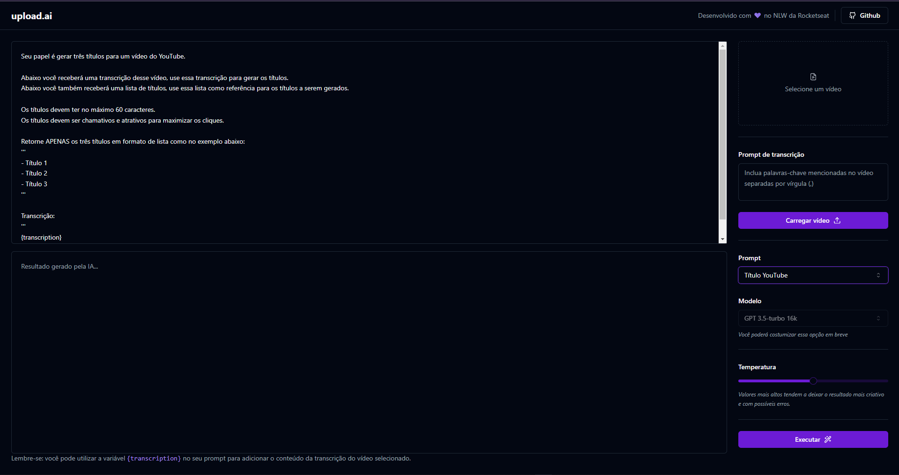

<h1 align="center">Upload.ai</h1>

<h1 align="center">
    
</h1>

<p align="center">
  🧠🤖<strong>Upload.ai</strong> é um aplicativo para geração automática de títulos e descrições de vídeos para o youtube usando a <strong>API da OpenAi</strong>🤖🧠
</p>

<br>

<p align="center"> Esse projeto foi desenvolvido com as seguintes tecnologias: </p>

<p align="center">
  
  
  
  
</p>

## 👨🏽‍💻 Como executar

Clone o projeto e acesse a pasta do mesmo.

```bash
$ git clone https://github.com/lipelourencosilva/nlw-ai/
$ cd nlw-ai
```

Para iniciá-lo, siga os passos abaixo:
```bash
# Instalar as dependências
$ npm install

# Iniciar o projeto
$ cd upload-ai-web
$ cd npm run dev

$ cd upload-ai-api
$ cd npm run dev
```
O app estará disponível no seu browser pelo endereço http://localhost:5173.

Lembrando que será necessário criar uma conta na OpenAi para manipular as informações com a API.

##

<p align="center">
  👨🏽‍💻 Desenvolvido durante a  <strong>Next Ai.</strong> 👨🏽‍💻
</p>
